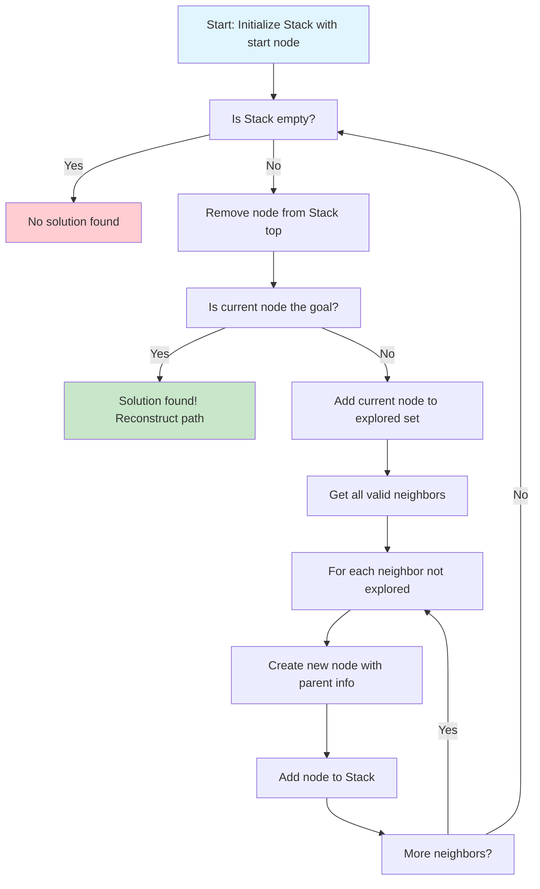
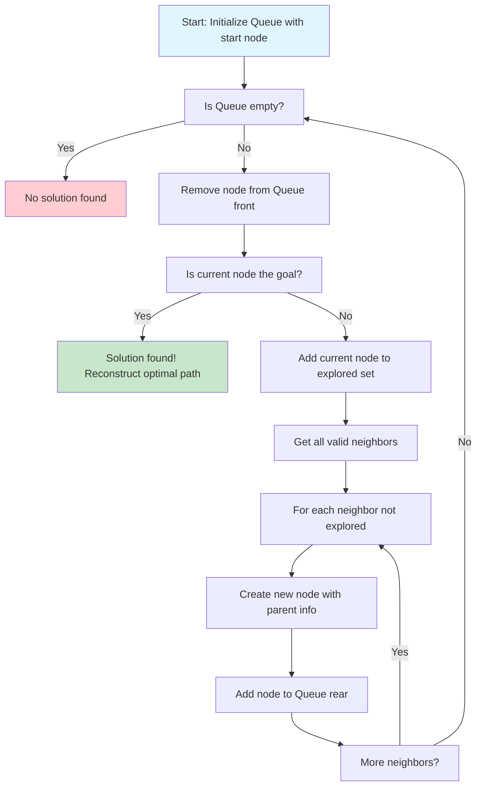
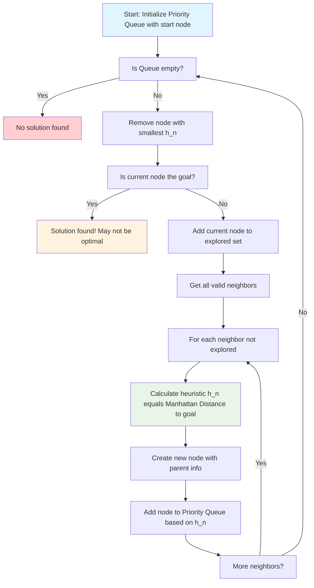
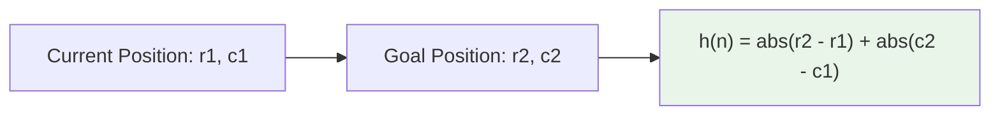
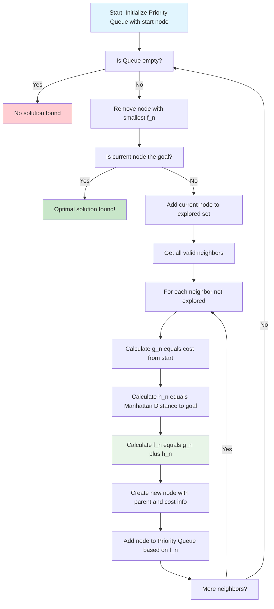
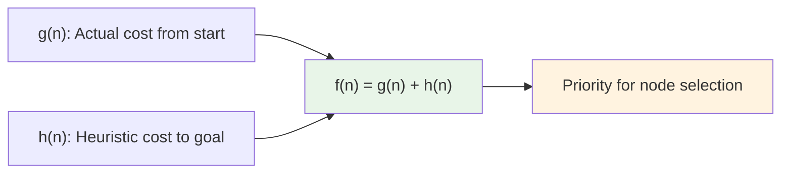
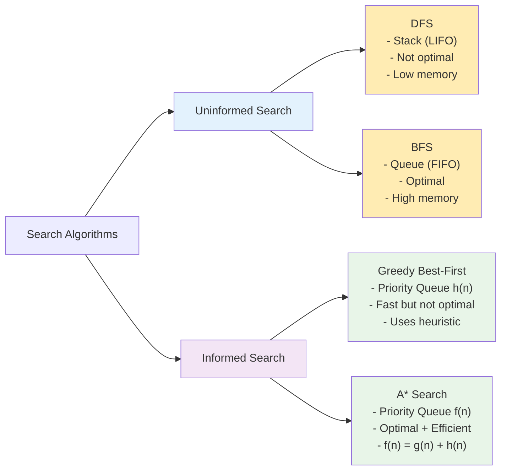
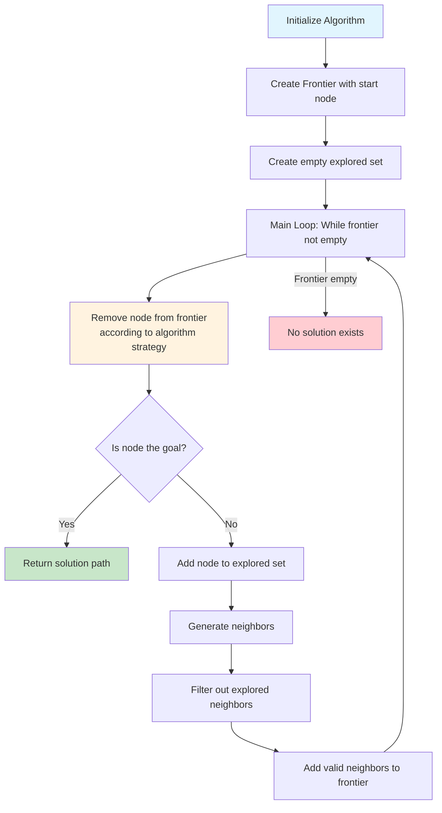

# Search Algorithms in Maze - Mermaid Diagrams

Tài liệu này chứa các biểu đồ Mermaid minh họa các thuật toán tìm kiếm đường đi trong mê cung được thực hiện trong bài thực hành.

## 1. Depth-First Search (DFS) Algorithm

DFS sử dụng cấu trúc Stack (LIFO - Last In First Out) để khám phá mê cung theo chiều sâu.

### Đặc điểm của DFS:
- **Cấu trúc**: Stack (LIFO)
- **Đặc tính**: Đi sâu trước, không đảm bảo tối ưu
- **Bộ nhớ**: Ít hơn BFS
- **Ứng dụng**: Khi cần tiết kiệm bộ nhớ

## 2. Breadth-First Search (BFS) Algorithm

BFS sử dụng cấu trúc Queue (FIFO - First In First Out) để khám phá theo chiều rộng.

### Đặc điểm của BFS:
- **Cấu trúc**: Queue (FIFO)
- **Đặc tính**: Đảm bảo đường đi ngắn nhất
- **Bộ nhớ**: Nhiều hơn DFS
- **Ứng dụng**: Khi cần đường đi tối ưu

## 3. Greedy Best-First Search Algorithm

Greedy Best-First Search sử dụng hàm heuristic để chọn node có vẻ gần đích nhất.

### Hàm Heuristic - Manhattan Distance:

### Đặc điểm của Greedy Best-First:
- **Cấu trúc**: Priority Queue dựa trên h(n)
- **Đặc tính**: Nhanh nhưng không đảm bảo tối ưu
- **Heuristic**: Manhattan Distance
- **Ứng dụng**: Khi cần giải pháp nhanh

## 4. A* Search Algorithm

A* kết hợp chi phí thực tế g(n) và heuristic h(n) để tạo ra f(n) = g(n) + h(n).

### A* Evaluation Function:

### Đặc điểm của A*:
- **Cấu trúc**: Priority Queue dựa trên f(n)
- **Đặc tính**: Tối ưu với heuristic admissible
- **Công thức**: f(n) = g(n) + h(n)
- **Ứng dụng**: Cân bằng tốc độ và chất lượng

## 5. So Sánh Các Thuật Toán

## 6. Bảng So Sánh Chi Tiết

| Thuật Toán | Cấu Trúc Dữ Liệu | Tối Ưu | Hoàn Thiện | Time Complexity | Space Complexity |
|------------|-------------------|---------|------------|-----------------|------------------|
| **DFS** | Stack (LIFO) | ❌ | ❌ | O(b^m) | O(bm) |
| **BFS** | Queue (FIFO) | ✅ | ✅ | O(b^d) | O(b^d) |
| **Greedy** | Priority Queue h(n) | ❌ | ❌ | O(b^m) | O(b^m) |
| **A*** | Priority Queue f(n) | ✅ | ✅ | O(b^d) | O(b^d) |

*Chú thích: b = branching factor, d = depth of solution, m = maximum depth*

## 7. Quy Trình Thực Hiện Chung

## 8. Lưu Ý Thực Hiện

### Điều Kiện Admissible cho A*:
- Heuristic h(n) không bao giờ overestimate chi phí thực tế
- Manhattan distance là admissible cho maze problem
- Đảm bảo A* tìm được solution tối ưu

### Tips Debugging:
1. In ra frontier sau mỗi bước
2. Kiểm tra explored set
3. Verify hàm heuristic
4. Test với maze đơn giản trước

---

*Tài liệu này được tạo để minh họa các thuật toán tìm kiếm trong bài thực hành Maze pathfinding.*
